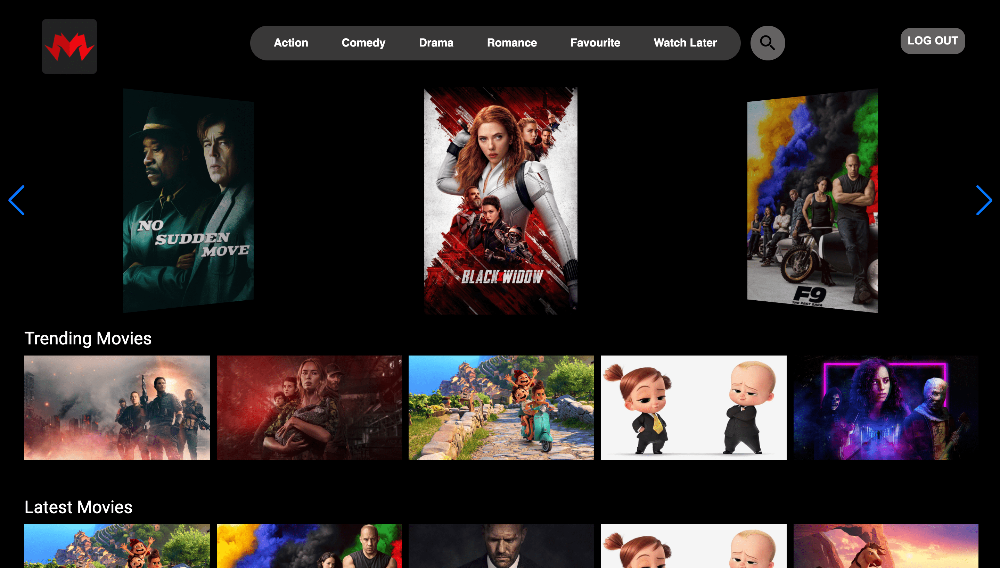
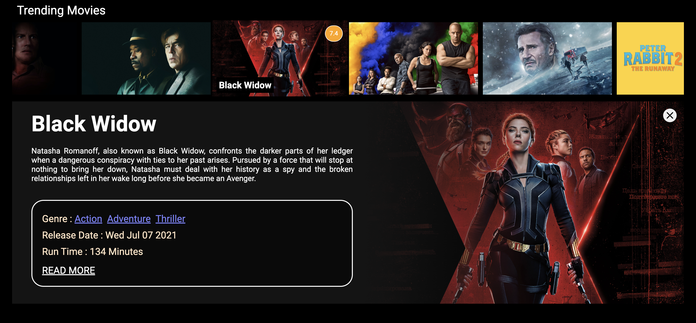
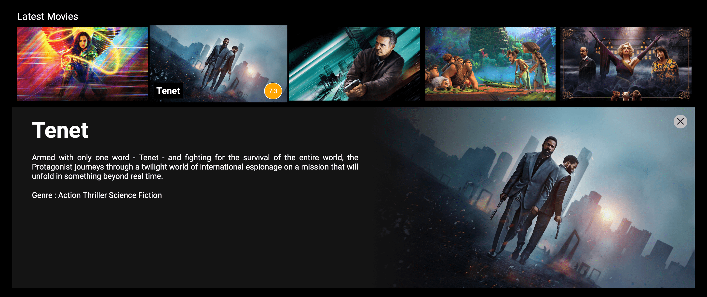
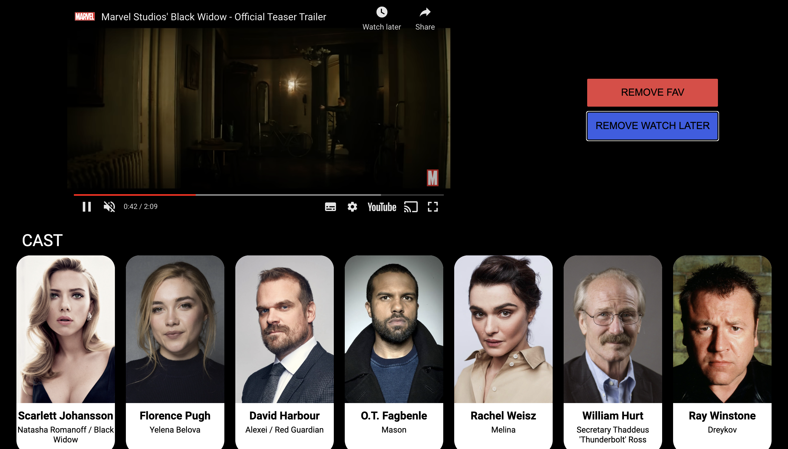

# MOVIE APP (REACT)

## Available Scripts

In the project directory, you can run:

### `npm start`

Runs the app in the development mode.\
Open [http://localhost:3000](http://localhost:3000) to view it in the browser.

### HOME PAGE

### DISPLAYING MOVIE DETAILS

### GENRE BASED SEARCH

### MOVIE SEARCH

### MOVIE HOME

### MOVIE CAST & CREW

### SUGGESTED MOVIE

(PROJECT IS STILL UNDER DEVELOPEMENT)
